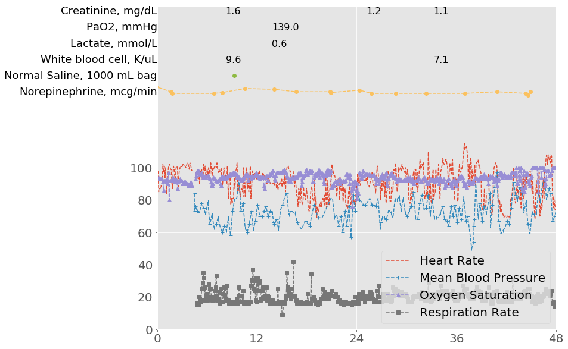

# Abstract{.unnumbered}

Critical care patients are severely ill and monitored intensely through the course of their illness. As a result of this monitoring, large amounts of data are routinely collected for these patients.
Philips Healthcare has developed a telehealth system, known as the eICU Program, which leverages these data to support management of critically ill patients.
Here we describe the eICU Collaborative Research Database, a multi-center intensive care unit (ICU) database with high granularity data for over 200,000 admissions to ICUs monitored by eICU Programs across the United States.
The data is de-identified, and includes vital sign measurements, care plan documentation, severity of illness measures, diagnosis information, treatment information, and more.
The data is publicly available, and requires minimal registration, including completion of a training course in research with human subjects and signing of a data use agreement mandating responsible handling of the data and adhering to the principle of collaborative research.
The freely available nature of the data will support a number of research applications into machine learning algorithms, decision support tools, and clinical knowledge generation.

# Background \& Summary

<!-- ICUs are expensive
[@Halpern2014]
- $1,699 per patient per bed day in 2005
- 32.7% increase in per day per bed patient cost from 2000 to 2005
- 5.82% increase compounded per year in the US
- ICUs represented 13.4% of hospital costs
- 0.66% GDP
[@NHS2010] - 2010 UK
- 1,219 pounds (level 2 ICU bed) per patient-bed-day
- 1,638 pounds (level 3 ICU bed) per patient-bed-day
- 5.01% of hospital costs
- 0.58% of the GDP
 -->

Intensive care units (ICUs) provide care for severely ill patients who require life-saving treatment. Critical care as a subspecialty of medicine began during a polio epidemic in which large number of patients required artificial ventilation for many weeks [@kelly2014intensive]. Since then, the field of critical care as grown, and continues to grow as demographics shift toward older populations [@adhikari2010critical].
Patients in ICUs are monitored heavily to detect physiologic deviation associated with deteriorating illness and change their treatment regimen as appropriate.
Monitoring of ICU patients is facilitated by bedside monitors which continuously stream huge quantities of data, though a relatively small portion of these data are archived for later analysis [@Celi2013loop].
Challenges to the archival of this data include integration of many disparate hospital systems, building a comprehensive system to handle all types of data, and storing the data in a form amenable to research [@johnson2016machine].

A telehealth ICU, or teleICU, is a centralized model of care where remote providers monitor ICU patients continuously, providing both structured consultations and reactive alerts [@lilly2014multicenter]. TeleICUs allow caregivers from remote locations to monitor treatments for patients, alert local providers to sudden deterioration, and supplement care plans.
Philips Healthcare, a major vendor of ICU equipment and services, provide a teleICU service known as the eICU program [@eICUProgram].
Care providers primarily access and document data in an information management system called eCareManager and additionally have access to the other information systems present in the hospital.
During routine use of the eICU program, large amounts of data are collected and transferred to remote locations. This data is archived by Philips and transformed into a research database by the eICU Research Institute (eRI).
The laboratory of computational physiology (LCP) partnered with eRI to produce the eICU Collaborative Research Database (eICU-CRD), a publicly available database sourced from the eICU telehealth program.

# Methods

## Database structure and development

eICU-CRD v1.2 is a relational database comprising of 17 tables.
All tables were de-identified to meet the safe harbor provision of HIPAA [@HIPAA]. These provisions include the removal of all personally identifiable patient identifiers, ages over 89, and other personal information. Large portions of all tables were manually reviewed by at least three personnel to verify all data had been de-identified.
Patient identifiers are generated randomly, and as a result the identifiers in eICU-CRD cannot be linked back to the original, identifiable data.
All hospital and ICU identifiers have also been removed to protect the privacy of contributing institutions and providers.

## Patient identifiers

Each patient stay in a unit, where the primary unit of care is the ICU, is identified by a single integer: the `patientunitstayid`. Each unique hospitalization is also assigned a unique integer, known as the `patienthealthsystemstayid`.
Finally, patients are identified by a `uniquepid`.
Unlike the other identifiers, `uniquepid` is generated using an algorithm created by Philips Healthcare adapted from prior work [@finney2011efficient].
Each `patienthealthsystemstayid` has at least one or more `patientunitstayid`, and each `uniquepid` can have multiple hospital and/or unit stays.
Figure \ref{fig:patient_organization} visualizes this hierarchy.
All tables use `patientunitstayid` to identify an individual unit stay, and the patient table can be used to determine unit stays linked to the same patient and/or hospitalization.

{ width=70% }

## Sample selection

A stratified random sample of patients was selected from the eRI research data repository.
The selection was done as follows: first, all hospital discharges between 2014 and 2015 were identified, and a single index stay for each unique patient was extracted.
The proportion of index stays in each hospital from the eRI data repository was used to perform a stratified sample of patient index stays based upon hospital; the aim was to maintain the distribution of first ICU stays across the hospitals in the dataset.
After a patient index stay was selected, all subsequent stays for that patient were also included in the dataset, regardless of the admitting hospital.
A small proportion of patients only had stays in step down units or low acuity units, and these stays were removed.
A detailed description of the sample selection is provided in the supplemental material.

<!--
1. Select stays which were discharged from the hospital in 2014 or 2015 using the hospital discharge year.
2. For each patient with an eligible stay, identify the index stay in the 2014-15 period, designate the
hospital where this occurred as the ‘home hospital’ for this patient.
3. Calculate the ‘home hospital’ distribution across all patients with an eligible stay. Denote these
proportions as pi (the proportion of patients with home hospital i).
4. Designate N as the target number of stays (in our case, N ≈ 200,000), and n as the number of unique
patients required to select about N stays. Approximate how large n should be based on the average
number of stays and the loss of ineligible stays (e.g., from SDUs) to achieve around N stays.
5. It was found that selecting about 29% of the eligible patients corresponded with approximately 200k
stays in the final dataset, and this corresponded with about n = 188k patients.
6. For patients with home hospital i, select ni = n × pi patients, and repeat this across all hospitals.
7. From these select n patients, collect all stays with a discharge in 2014-15, regardless if they occurred at
the home hospital or a different hospital.
8. Remove stays occurring in an SDU or acute unit. Remove stays which occurred at hospitals with
incomplete vital signs or other information.
-->

## Code availability

<!--
Philips ETL code is proprietary and unavailable.
LCP code is available (?): eicu-building
-->

# Data records

eICU-CRD comprises 200,859 patient unit encounters for 139,367 unique patients admitted between 2014 and 2015.
Patients were admitted to one of 335 units at 208 hospitals located throughout the US.
Table 1 provides demographics of the dataset, including hospital level characteristics.

| Data                             | Median [IQR], Mean (STD), or Number (%) |
|:---------------------------------|:--------------------|
| Age, years (median [IQR])        | 65.00 [53.00,76.00] |
| Unit length of stay, days (median [IQR]) | 1.57 [0.82,2.97]    |
| Hospital length of stay, days (median [IQR]) | 5.49 [2.90,10.04]   |
| Admission height, cm (mean (std))*     | 169.25 (13.69)      |
| Admission weight, kg (mean (std))*     | 83.93 (27.09)       |
| Gender (n (%))                     |                     |
|   Male                           | 108379 (53.96)      |
|   Female                         |  92303 (45.95)       |
|   Other or Unknown                 | 177 (0.09)          |
| Ethnicity (n (%))                  |                     |
|   African American                 | 21308 (10.61)       |
|   Asian                            | 3270 (1.63)         |
|   Caucasian                        | 155285 (77.31)      |
|   Hispanic                         | 7464 (3.72)         |
|   Native American                  | 1700 (0.85)         |
|   Other/Unknown                    | 11832 (5.89)        |
| Hospital discharge year (n (%))    |                     |
|   2014                             | 95513 (47.55)       |
|   2015                             | 105346 (52.45)      |
| Unit type (n (%))                |                     |
|   CCU-CTICU                        | 15290 (7.61)        |
|   CSICU                            | 9625 (4.79)         |
|   CTICU                            | 6158 (3.07)         |
|   Cardiac ICU                      | 12467 (6.21)        |
|   MICU                             | 17465 (8.70)        |
|   Med-Surg ICU                     | 113222 (56.37)      |
|   Neuro ICU                        | 14451 (7.19)        |
|   SICU                             | 12181 (6.06)        |
| Status at unit discharge (n (%))      |                     |
|   Alive                            | 189918 (94.55)      |
|   Expired                          | 10907 (5.43)        |
|   Unknown                          | 34 (0.02)           |
| Status at hospital discharge (n (%))  |                     |
|   Alive                          | 181104 (90.16)      |
|   Expired                        | 18004 (8.96)        |
|   Unknown                        | 1751 (0.87)         |
Table 1: Demographics of the 200,859 unit admissions in the database. Note that multiple unit admissions can correspond to the same patient. \* Missing data excluded from calculation.

Table 2 highlights the top 10 most frequent admission diagnoses in the dataset as coded by trained eICU clinicians using the APACHE IV diagnosis system [@zimmerman2006acute].
Table 3 collapses APACHE diagnoses into 21 groups which are more clinically intuitive. Patients who are missing APACHE IV hospital mortality predictions are excluded from both tables (N=64,623). Patients will not have an APACHE IV hospital mortality prediction if they satisfy exclusion criteria for APACHE IV (burns patients, in-hospital readmissions, some transplant patients), or if their diagnosis is not documented within the first day of their ICU stay.

| APACHE Diagnosis | Number of patients(%) |
|-----|-----|-----|
| Sepsis, pulmonary                        |  6823 (5.01) |
| Infarction, acute myocardial (MI)        |  5919 (4.34) |
| CVA, cerebrovascular accident/stroke     |  5284 (3.88) |
| CHF, congestive heart failure            |  4840 (3.55) |
| Sepsis, renal/UTI (including bladder)    |  4284 (3.14) |
| Diabetic ketoacidosis                    |  4001 (2.94) |
| CABG alone, coronary artery bypass grafting |  3635 (2.67) |
| Rhythm disturbance (atrial, supraventricular) |  3474 (2.55) |
| Cardiac arrest (with or without respiratory arrest; for respiratory arrest see Respiratory System) |  3377 (2.48) |
| Emphysema/bronchitis                     |  3304 (2.43) |
| Pneumonia, bacterial                     |  3045 (2.24) |
Table 2: Most frequent admission diagnoses as coded using the APACHE-IV diagnosis system. Percentages are calculated for the 136,236 patient stays with an APACHE IV hospital mortality prediction.

| APACHE Diagnosis category | Number of patients (%) |
|-----|-----|
| Sepsis                                   | 18087 (16.40) |
| Cerebrovascular accident                 |  9758 (8.85) |
| Cardiac Arrest                           |  9135 (8.28) |
| Acute Coronary Syndrome                  |  8343 (7.57) |
| Respiratory medicine                     |  7970 (7.23) |
| Gastrointestinal Bleed                   |  7277 (6.60) |
| Congestive Heart Failure                 |  5884 (5.34) |
| Trauma                                   |  5592 (5.07) |
| Coronary Artery Bypass Graft             |  4771 (4.33) |
| Neurological                             |  4640 (4.21) |
| Pneumonia                                |  4577 (4.15) |
| Diabetic Ketoacidosis                    |  4384 (3.98) |
| Overdose                                 |  4268 (3.87) |
| Asthma/Emphysema                         |  3948 (3.58) |
| Other cardiovascular disease             |  3593 (3.26) |
| Valvular disorders                       |  2795 (2.53) |
| Coma                                     |  2082 (1.89) |
| Acute renal failure                      |  1932 (1.75) |
| Gastrointestinal obstruction             |  1232 (1.12) |
Table 3: Most frequent categories of APACHE diagnosis using clinically meaningful groups. Patients who are missing APACHE-IV hospital mortality predictions are excluded (N=64,623, includes burns patients, in-hospital readmissions, and other APACHE exclusion criteria).

## Classes of data

Data includes vital signs, laboratory measurements, medications, APACHE components, care plan information, admission diagnosis, patient history, time-stamped diagnoses from a structured problem list, and similarly chosen treatments. Data is organized into tables which broadly correspond to the type of data contained within the table. Table 3 gives an overview of tables on the database.

| Group | Table name | Type of data |
|-------|------------|--------------|
| Administrative information | hospital | Hospital level survey information: bed size, teaching status, and US region |
| Administrative information | patient | Demographic and administrative information regarding the patient and their unit/hospital stay |
| APACHE | admissiondx | APACHE Admission diagnoses and other APACHE information |
| APACHE | apacheapsvar | Acute Physiology Score (APS)-III components for APACHE predictions |
| APACHE | apachepredvar | Components for the APACHE predictions |
| APACHE | apachepatientresult | Predictions made from the APACHE IV system (versions IV and IVa) |
| Care plan | careplancareprovider | Information regarding the current care providers for the patient |
| Care plan | careplaneol | End of life care planning |
| Care plan | careplangeneral | Care plan for the patient, including end of life care |
| Care plan | careplangoal | Stated goals of care for the patient |
| Care plan | careplaninfectiousdisease | Precautions for patient related to infectious disease |
| Care documentation | admissionDrug | Medications taken prior to unit admission |
| Care documentation | diagnosis | Structured list detailing ongoing problems/diagnoses |
| Care documentation | infusionDrug | Continuous infusions administered during the unit stay |
| Care documentation | lab | Laboratory measurements |
| Care documentation | medication | Prescribed medications |
| Care documentation | pasthistory | Structured list detailing patient's health status prior to presentation in the unit |
| Care documentation | treatment | Structured list detailing active treatments provided to the patient |
| Monitor data | vitalaperiodic | Aperiodic vital sign measurements (unevenly sampled) |
| Monitor data | vitalperiodic | Periodic vital sign measurements (5 minute interval) |
Table 3: Tables with data in the database.

### Administrative data

Hospital level information is available in the `hospital` table, and includes the region the hospital is located in (midwest, northeast, west, south), whether the hospital is a teaching hospital, and the number of beds in the hospital. Hospital information is the result of a survey and is incomplete: 10% of hospital have unknown teaching status, 39% have unknown region, and 48% have unknown bed capacity. Table 4 shows the percentage of hospital data in each category.

| Hospital level factor              | Number of hospitals (%)  | Number of patients (%) |
|:-----------------------------------|:------------|:------------|
| Bed capacity                       |             |             |
|   \<100                            | 46	(22.12)  | 12593	(6.27)  |
|   100 - 249                        | 62	(29.81)  | 41966	(20.89) |
|   250 - 499                        | 35	(16.83)  | 45716	(22.76) |
|   >= 500                           | 23	(11.06)  | 75305	(37.49) |
|   Unknown                          | 42	(20.19)  | 25279	(12.59) |
| Teaching status                    |             |             |
|   False                            | 189 (90.87) | 149181	(74.27) |
|   True                             | 19 (9.13)   | 51678	(25.73) |
| Region                             |             |             |
|   Midwest                          | 70	(33.65) | 65950	(32.83) |
|   Northeast                        | 13	(6.25)   | 14429	(7.18) |
|   South                            | 56	(26.92)  | 60294	(30.02) |
|   West                             | 43	(20.67)  | 46348	(23.07) |
|   Unknown                          | 26	(12.50) | 13838	(6.89) |
Table 4: Hospital level information.

Patient information is recorded in the `patient` table.
The three identifiers described earlier (`patientunitstayid`, `patienthealthsystemstayid`, `uniquepid`) are present in this table. Administrative information is recorded here including: admission/discharge time, unit type, admission source, discharge location, and patient vital status on discharge. Patient demographics are also present in the `patient` table including age (with ages > 89 grouped into '> 89'), ethnicity, height, and weight.

### APACHE data

The Acute Physiology and Chronic Health Evaluation (APACHE) IV system [@zimmerman2006acute] is a tool used to risk-adjust ICU patients for ICU performance benchmarking and quality improvement analysis.
The APACHE IV system, among other predictions, provides estimates of the probability that a patient dies given data from the first 24 hours. These predictions, on aggregate across many patients, can be used to benchmark hospitals and subsequently identify policies from hospitals which are beneficial for patient outcomes.
In order to make these predictions, care providers must collect a set of parameters regarding the patient: physiologic measurements, comorbid burden, treatments given, and admission diagnosis. These parameters are used in a logistic regression to predict mortality.
eICU-CRD contains all parameters used in the APACHE IV equations: physiologic parameters are primarily stored in `apacheapsvar`, and other parameters are stored in `apachepredvar`. The result of the predictions for both the APACHE IV and the updated APACHE IVa equation are available in `apachepatientresult`.
This data provides an excellent estimate of patient severity of illness on admission to the ICU, though it should be noted that these predictions are not available for every patient, in particular: those who stay less than 4 hours, burns patients, certain transplant patients, and in-hospital readmissions. See the original publication for more detail [@zimmerman2006acute].

### Care plan

The care plan is a section of eCareManager which is primarily used for intraprofessional communication. The data is documented using structured multiple choice lists and is used to communicate care provider type, provider specialty, code status, prognosis, treatment status, goals of care, healthcare proxies, and facilitate end-of-life discussion.

### Care documentation

Drop down lists available in eCareManager allow for structured documentation of active problems and active treatments for a patient. The active problems documentation is recorded in the `diagnosis` table, with 86% of patients having a documented active problem during the first 24 hours of their unit stay. There were a total of 3,933 unique active problems; the most common was acute respiratory failure (11.15% of patients), followed by acute renal failure (8.15% of patients) and diabetes (7.28% of patients). Problems are hierarchically categorized, and Table 5 shows the proportion of patients with an active problem for each organ system. Note that a patient can have problems documented for multiple organ systems.

| Diagnosis group | Number of patients (%) |
|:----------------|:-----------------------|
| cardiovascular | 104264 (11.15%) |
| pulmonary | 64222 (8.15%) |
| neurologic | 51609 (7.28%) |
| renal | 43009 (6.38%) |
| endocrine | 35519 (6.15%) |
| gastrointestinal | 35223 (6.10%) |
| infectious diseases | 20316 (6.01%) |
| hematology | 19611 (5.32%) |
| burns/trauma | 9208 (5.13%) |
| oncology | 7954 (4.72%) |
| toxicology | 7185 (4.47%) |
| surgery | 5723 (3.97%) |
| general | 1698 (3.91%) |
| transplant | 770 (3.75%) |
| obstetrics/gynecology | 46 (3.52%) |
| genitourinary | 26 (3.18%) |
| musculoskeletal | 19 (2.98%) |
Table 5: Organ system for problems documented during patient unit stays.

Active treatments are documented in the `treatment` table.
There are 2,711 unique treatments documented using a hierarchical coding system. The most frequent treatments explicitly documented in the table across patients were mechanical ventilation (16.96% of patients), chest x-rays (8.79% of patients), oxygen therapy via a nasal cannula with a low fraction of oxygen (6.93% of patients), and normal saline administration (7.57%).

Laboratory values collected during routine care are interfaced with eCareManager and archived in the database. 158 distinct types of laboratory measurements are available in the database. Figure X shows number of distinct laboratory measurements available for each patient. values within the hospital and are stored with the unit of measurement and last time the value was revised.

### Monitor data

Large quantities of data are continuously recorded on ICU patients and displayed via bedside monitors. The `vitalperiodic` and `vitalaperiodic` tables contain data derived directly from these bedside monitors.
Unlike other data elements in the database, the data collected in these tables are *unvalidated*, in that it has been automatically derived and archived with no manual documentation or verification.

Periodic vital signs are recorded every 5 minutes in the `vitalperiodic` table and include heart rate, respiratory rate, oxygen saturation, temperature, invasive arterial blood pressure, pulmonary artery pressure, ST levels, and intracranial pressure (ICP). The most frequently available periodic vital sign is heart rate (available for 96% of patients), and the least available periodic vital sign is ICP (available for 0.81% of patients). Table 6 summarizes data completion for periodic vital signs.

| Data type | Column name | Number of patients (%) | Total number of observations (average patient-wise) |
|:----------------|:-----------------------|:-------------------|
| Heart rate                               | heartrate          | 192277 (95.73%) | 145,979,794 (759.2)
| Peripheral oxygen saturation             | sao2               | 189646 (94.42%) | 132,908,266 (700.8)
| Respiration rate                         | respiration        | 178051 (88.64%) | 128,501,032 (721.7)
| ST level                                 | st2                |  98886 (49.23%) | 59,949,273 (606.2)
| ST level                                 | st1                |  95643 (47.62%) | 56,604,917 (591.8)
| ST level                                 | st3                |  92752 (46.18%) | 55,201,239 (595.1)
| Invasive mean blood pressure             | systemicmean       |  46975 (23.39%) | 28,060,870 (597.4)
| Invasive systolic blood pressure         | systemicsystolic   |  46667 (23.23%) | 27,834,959 (596.5)
| Invasive diastolic blood pressure        | systemicdiastolic  |  46661 (23.23%) | 27,833,847 (596.5)
| Central venous pressure                  | cvp                |  28698 (14.29%) | 19,157,758 (667.6)
| Temperature                              | temperature        |  19419 (9.67%) | 13,203,289 (679.9)
| Mean pulmonary artery pressure           | pamean             |  10893 (5.42%) | 4,150,132 (381.0)
| Diastolic pulmonary artery pressure      | padiastolic        |  10792 (5.37%) | 4,120,636 (381.8)
| Systolic pulmonary artery pressure       | pasystolic         |  10789 (5.37%) | 4,121,138 (382.0)
| End tidal carbon dioxide concentration   | etco2              |   8346 (4.16%) | 4,423,333 (530.0)
| Intracranial pressure                    | icp                |   1634 (0.81%) | 2,631,227 (1610.3)
Table 6: Data available in `vitalperiodic` table, including the number of patients who have at least one measurement, the total number of observations available, and the average number of observations available per patient.

Aperiodic vital signs are collected at various times and include non-invasive blood pressure, pulmonary artery occlusion pressure (PAOP), cardiac output, cardiac input, systemic vascular resistance (SVR), SVR index (SVRi), pulmonary vascular resistance (PVR), and PVR index (PVRi). The most frequent aperiodic vital sign is blood pressure (available for 94% of patients), and the least frequent is PVRi (available for 0.93% of patients).

# Technical validation

Data were verified for integrity during the data transfer process from Philips to MIT. In order to maintain the clinical applicability of tools generated from the data, very little data post-processing has been performed.
Each participant hospital in the database have customized workflows and clinical documentation processes, and as a result, the reliability and completion of data elements varies on a hospital and/or ICU level. Table 7 describes this data completion across tables, showing the number of hospitals with low, medium, and high data completion.

| Table Name | No data (0%) | Low coverage (0-20%) | Medium coverage (20-60%) | High coverage (60-80%) | Excellent coverage (80-100%) |
|:----|:----|:----|:----|:-----|:----|
| admissiondx               |  0.48 |  0.48 |  5.77 | 15.38 | 77.88 |
| admissiondrug             | 41.35 | 24.52 | 19.23 |  2.88 | 12.02 |
| apacheapsvar              |  0.00 |  0.48 |  6.73 | 14.90 | 77.88 |
| apachepredvar             |  0.00 |  0.48 |  6.73 | 14.90 | 77.88 |
| apachepatientresult       |  8.65 |  0.96 | 16.83 | 12.98 | 60.58 |
| careplancareprovider      |  0.96 |  0.96 | 12.02 | 12.98 | 73.08 |
| careplaneol               | 53.85 | 46.15 |  0.00 |  0.00 |  0.00 |
| careplangeneral           |  0.48 |  0.00 |  0.48 |  2.40 | 96.63 |
| careplangoal              | 62.98 | 27.40 |  0.96 |  4.33 |  4.33 |
| careplaninfectiousdisease | 53.85 | 38.94 |  6.73 |  0.48 |  0.00 |
| diagnosis                 |  0.48 |  0.48 | 11.54 | 11.54 | 75.96 |
| infusiondrug              | 26.92 | 16.35 | 40.38 |  9.62 |  6.73 |
| lab                       |  0.48 |  0.00 |  0.48 |  2.88 | 96.15 |
| medication                | 16.35 |  7.21 |  2.40 |  1.92 | 72.12 |
| pasthistory               |  0.48 |  0.48 |  4.33 | 17.31 | 77.40 |
| treatment                 |  6.25 |  3.37 | 12.98 | 11.54 | 65.87 |
| vitalaperiodic            |  0.96 |  0.00 |  3.85 |  5.29 | 89.90 |
| vitalperiodic             |  0.96 |  0.00 |  3.37 |  2.40 | 93.27 |
Table 7: Data completion grouped by table and tabulated by hospitals. Data completion is assessed by the percent of patient unit stays with data. For example, if between 0-20% of `patientUnitStayId` at a hospital have data, then we term this low coverage, and 41.35% of hospitals have low coverage for `admissionDrug`.

A public issue tracker is used as a forum for reporting technical issues and describing solutions.
Database updates, including the correction of technical errors and the inclusion of additional data tables, are planned for future releases.

# Usage notes

## Data access

Data can be accessed via a PhysioNetWorks repository [@data-doi]. Usage of the data requires proof of completion for a course on using human subjects in research (e.g. Human Subjects Research from the Collaborative Institutional Training Initiative [@citicourse]).
Usage of the data also requires signing of a data use agreement stipulating, among other items; that the user will not share the data, will not attempt to re-identify any patients or institutions, and will release code associated with any publication using the data.
The full data use agreement is provided in the supplemental material.

## Collaborative code and documentation

As the aim of the eICU-CRD is to foster collaboration in secondary analysis of electronic health records, we have created an openly available repository for sharing code [@eicu-code].
<!-- https://github.com/mit-eicu/eicu-code -->
As data collection in the database varies across hospitals, code to extract reliable and consistent definitions for key clinical concepts is of utmost importance.
Open and collaborative work on this code will improve its robustness and improve the reproducibility of subsequent research which relies upon these concepts.

Detailed documentation is also available online^[http://eicu-crd.mit.edu] and is continuously developed. Community contributions to the documentation can be made via the documentation repository [@eicu-website-repo].

## Example usage

<!-- Can use SQL/PostgreSQL to access. We provide code from above repo to facilitate building it -->
A publicly accessible Jupyter Notebook is provided to demonstrate usage of the data [@pergra2007ipython, @kluyver2016jupyter]. The notebook overviews extraction of data for a single patient and visualization of the patients data throughout their ICU stay.
Figure \ref{fig:example_patient} provides this visualization for a subset of the patient's stay. This notebook is publicly available at the previously described code repository [@eicu-code].

{ width=70% }

# Conclusion

We have described the eICU Collaborative Research Database, a large multi-center dataset with rich information for 200,859 ICU stays across the US. This real world clinical dataset is a unique resource which allows for a number of research applications. Furthermore, the publicly accessible nature of the dataset allows for end-to-end reproducible research, which is a challenging task when working with patient data.

# Acknowledgments{.unnumbered}

The authors would like to thank the Philips eICU Research Institute and Philips Healthcare for contribution of the data.

# Funding{.unnumbered}

This work has been supported by grants NIH-R01-EB017205, NIH-R01-EB001659, and NIH-R01-GW104987 from the National Institutes of Health and by Philips Healthcare.

# Author contributions{.unnumbered}

AEWJ and TJP collaborated to publish the data and write the paper. JDR performed sample selection and provided the documentation for the process. LAC, RGM, and OB reviewed the paper and supervised the work.

# Competing interests{.unnumbered}

The MIT Laboratory for Computational Physiology received funding from Philips Healthcare to undertake work on the database described in this paper. OB is an employees of Philips Healthcare. The authors have no additional competing interests to declare.

# Data citation{.unnumbered}

# References{.unnumbered}
