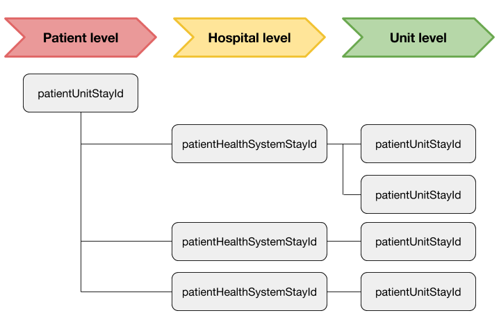

<!--
Figure/Table list
Table 1. Demographics
Table 2. Top 10 Diagnoses
Table 3. Data completion by patientunitstayid
Table 4. Planned/excluded tables

Figure 1. Funnel plot of hospitals
Figure 2. Example patient

-->

# Abstract{.unnumbered}

- Introduce the eICU Collaborative Research Database.
- Valuable dataset for research and education.

# Background \& Summary

Intensive care units (ICUs) provide care for severely ill patients who require life-saving treatment. Critical care as a subspecialty of medicine began during a polio epidemic in which large number of patients required artificial ventilation for many weeks [@Kelly2014+Fongster]. Since then, the field of critical care as grown, accounting for over 1% of the gross domestic product of the United States (US) in 2014 [@Halpern20??].
Patients in ICUs are monitored heavily to detect physiologic deviation associated with deteriorating illness and change their treatment regimen as appropriate.
Monitoring of ICU patients is facilitated by bedside monitors which continuously stream huge quantities of data, and a relatively small portion of this data is archived for later analysis [@Celi].

Philips Healthcare, a major vendor of ICU equipment and services, provide the eICU program as a service [@eICUProgram]. The Philips eICU program is a telehealth service which provides telemonitoring services to ICUs across the US and internationally. The program allows caregivers from remote locations to monitor treatments for patients, alert local providers to sudden deterioration, and supplement care plans.
During routine use of the eICU program, large amounts of data are collected and transferred to remote locations. This data is archived by Philips and transformed into a research database by the eICU Research Institute (eRI).
The laboratory of computational physiology (LCP) partnered with eRI to produce the eICU Collaborative Research Database (eICU-CRD), a publicly available database sourced from the eICU telehealth program.

<!--
- Previously shared MIMIC-III [@MIMIC2016]
-->

# Methods

## Database development and structure

<!--
Data is denormalized.
Philips ETL generates the schema.
LCP do not modify this ETL but further de-identify the data.
-->
eICU-CRD was created according to a relational schema comprising of 17 tables.

Each patient stay in a unit, where the primary unit of care is the ICU, is identified by a single integer: the `patientunitstayid`. Each unique hospitalization is also assigned a unique integer, known as the `patienthealthsystemstayid`. Finally, patients are identified by a `uniquepid`. Each `patienthealthsystemstayid` has at least one or more `patientunitstayid`, and each `uniquepid` can have multiple hospital and/or unit stays.
Figure \ref{fig:patient_organization} visualizes this hierarchy.
All tables use `patientunitstayid` to identify an individual unit stay, and the patient table can be used to determine unit stays linked to the same patient and/or hospitalization.

{ width=70% }

Figure ? shows the database schema.

## Sample selection

A representative sample of patients was extracted from the eRI data warehouse. This sample of patients was selected by ...
<!-- TODO: Jesse's doc -->

## Deidentification

All tables were de-identified to meet the safe harbor provision of HIPAA. These provisions include the removal of all personally identifiable patient identifiers, ages over 89, and other personal information. Data was de-identified using a python package based upon a publicly available de-identification package which has previously been used to de-identify electronic health records [@perlpackage]. Large portions of all tables were manually reviewed by at least three personnel to verify all data had been de-identified.

## Code availability

<!--
Philips ETL code is proprietary and unavailable.
LCP code is available (?): eicu-building
-->

# Data records

eICU-CRD comprises 200,859 patient unit encounters for 139,367 unique patients.
Patients were admitted to one of 335 units at 208 hospitals located throughout the US.
Table 1 provides demographics of the dataset, including hospital level characteristics.

<!-- Table 1 -->

Table 2 highlights the top 10 most frequent admission diagnoses in the dataset as coded by the APACHE IV diagnosis system [@Zimmerman2008].

Diagnosis | Number | Percent
--- | --- | ---
No diagnosis available | 22996 | 11.45
Sepsis, pulmonary | 8862 | 4.41
Infarction, acute myocardial (MI) | 7228 | 3.60
CVA, cerebrovascular accident/stroke | 6647 | 3.31
CHF, congestive heart failure | 6617 | 3.29
Sepsis, renal/UTI (including bladder) | 5273 | 2.62
Rhythm disturbance (atrial, supraventricular) | 4827 | 2.40
Diabetic ketoacidosis | 4825 | 2.40
Cardiac arrest (with or without respiratory arrest; for respiratory arrest see Respiratory System) | 4580 | 2.28
CABG alone, coronary artery bypass grafting | 4543 | 2.26

## Classes of data

Data includes vital signs, laboratory measurements, medications, APACHE components, care plan information, admission diagnosis, patient history, time-stamped diagnoses from a structured problem list, and similarly chosen treatments. Data is organized into tables which broadly correspond to the type of data contained within the table. Table 3 gives an overview of tables on the database.

Table name | Type of data
--- | ---
admissiondx | APACHE Admission diagnoses and other APACHE information
apacheapsvar | Acute Physiology Score (APS)-III components for APACHE predictions
apachepredvar | Components for the APACHE predictions
apachepatientresult | Predictions made from the APACHE IV system (versions IV and IVa)
careplancareprovider | Information regarding the current care providers for the patient
careplaneol | End of life care planning
careplangeneral | Care plan for the patient, including end of life care
careplangoal | Stated goals of care for the patient
careplaninfectiousdisease | Precautions for patient related to infectious disease
diagnosis | Structured list detailing ongoing problems/diagnoses
hospital | Hospital level survey information: bed size, teaching status, and US region
lab | Laboratory measurements
pasthistory | Structured list detailing patient's health status prior to presentation in the unit
patient | Demographic and administrative information regarding the patient and their unit/hospital stay
treatment | Structured list detailing active treatments provided to the patient
vitalaperiodic | Aperiodic vital sign measurements (unevenly sampled)
vitalperiodic | Periodic vital sign measurements (5 minute interval)

### APACHE data

### Care plan

### Administrative data

### Structured drop down lists

Treatments and diagnoses are selected by the care giver from a drop down list of options. There are ???? unique treatments and ???? unique diagnoses in the database. Both treatment and body system use a hierarchical coding system allowing for specification of terms corresponding to overarching groups such as body system. Care plans are similarly structured but do not have the same hierarchical grouping as treatments and diagnoses.

### Time-stamped measurements

Periodic vital signs are recorded every 5 minutes and include heart rate, respiratory rate, oxygen saturation, temperature, invasive arterial blood pressure, pulmonary artery pressure, ST levels, and intracranial pressure (ICP). Periodic vital signs are not validated by care staff and not available for all patients. The most frequently available periodic vital sign is heart rate (??%), and the least available periodic vital sign is ICP (??%). Aperiodic vital signs are collected at various times and include non-invasive blood pressure, PAOP, cardiac output, cardiac input, SVR, SVRi, PVR, and PVRi. The most frequent aperiodic vital sign is mean blood pressure (??%), and the least frequent is PVRi (??%).

Laboratory values are collected within the hospital and are stored with the unit of measurement and last time the value was revised.

# Technical validation

- Changes were kept to a minimum
- Issue tracking used to keep track of issues
- Compared distribution of X to MIMIC. Figure shows...

# Usage notes

## Data access

Data can be accessed via a PhysioNetWorks repository [@data-doi]. Usage of the data requires proof of completion for a course on using human subjects in research. Usage of the data also requires signing of a data use agreement stipulating, among other items, that the user will not share the data and will not attempt to re-identify any patients or institutions.

## Collaborative code

As the aim of the eICU-CRD is to foster collaboration in secondary analysis of electronic health records, we have created an openly available repository for sharing code [@eicu-code].
<!-- https://github.com/mit-eicu/eicu-code -->
Code used to extract concepts from the data is under continuous development.

## Example usage

<!-- Can use SQL/PostgreSQL to access. We provide code from above repo to facilitate building it -->

Figure 2 provides a visualization of data available for a single patient.

<!-- TODO figure 1 -->

- Examples of usage include...

# Conclusion

- Shared a unique resource
- Move towards end-to-end reproducible research

# Acknowledgments{.unnumbered}

The authors would like to thank...

# Funding{.unnumbered}

This work has been supported by grants NIH-R01-EB017205, NIH-R01-EB001659, and NIH-R01-GW104987 from the National Institutes of Health.

# Author contributions{.unnumbered}

XXXX

# Competing interests{.unnumbered}

The MIT Laboratory for Computational Physiology received funding from Philips Healthcare to undertake work on the database described in this paper. XXX are employees of Philips Healthcare. The authors have no additional competing interests to declare.

# References{.unnumbered}
